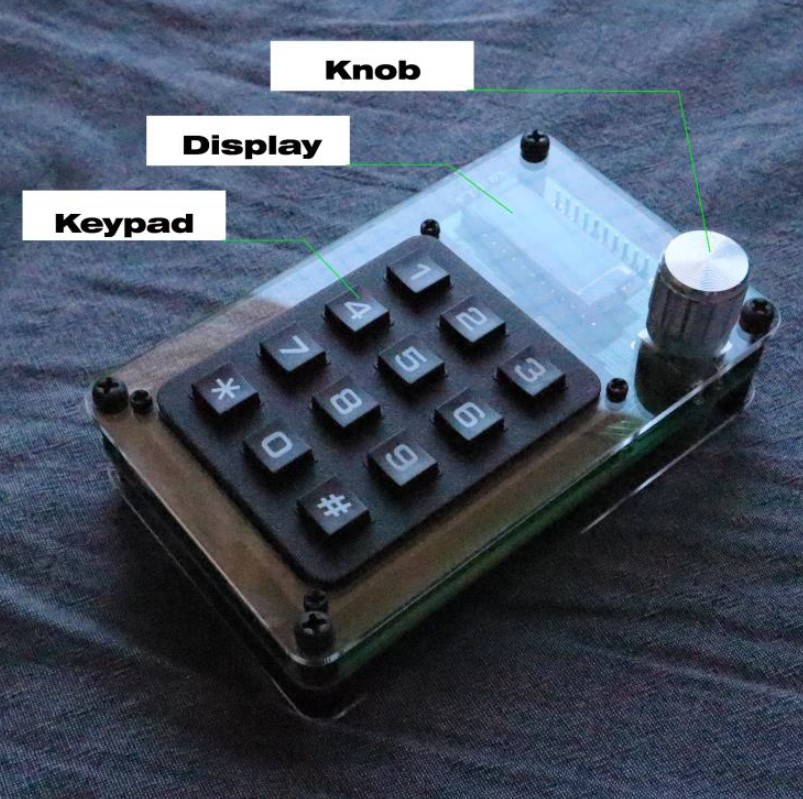
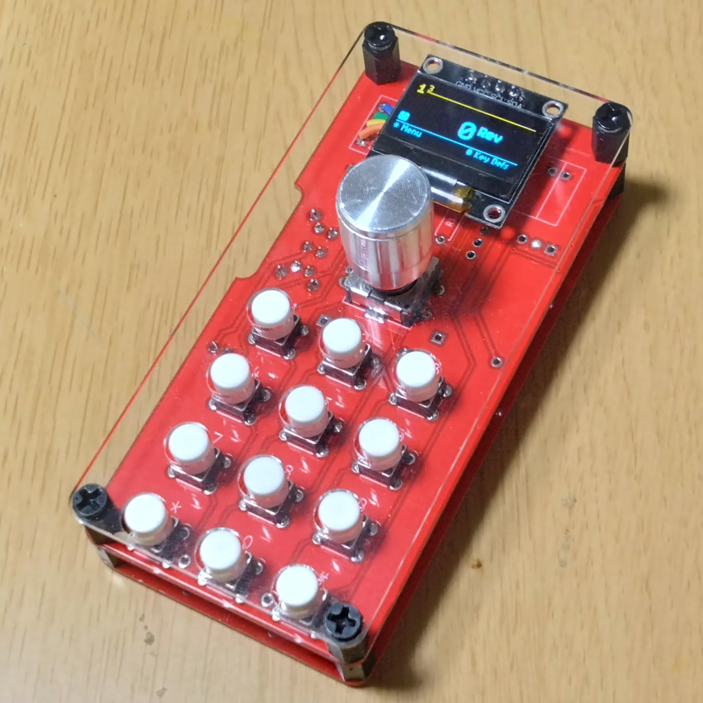
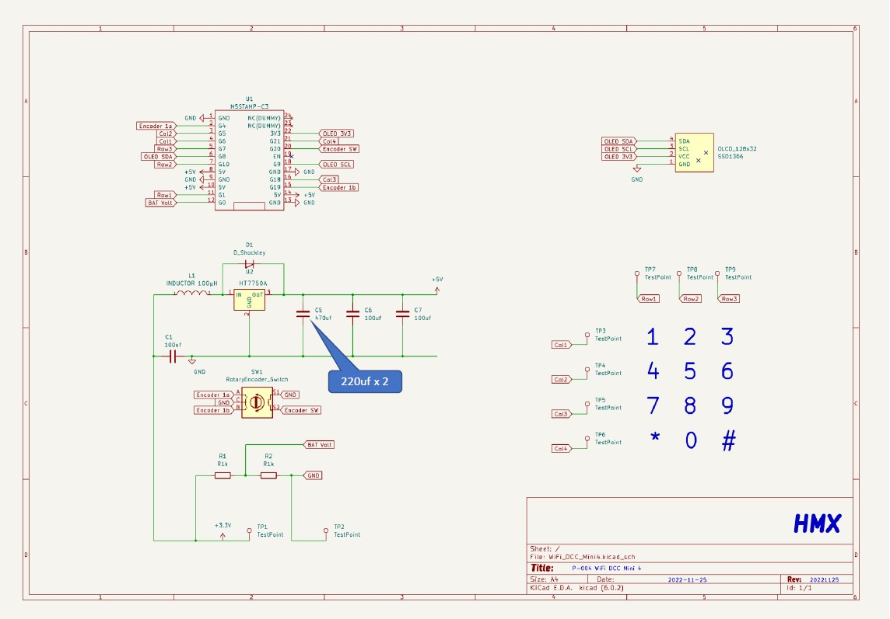
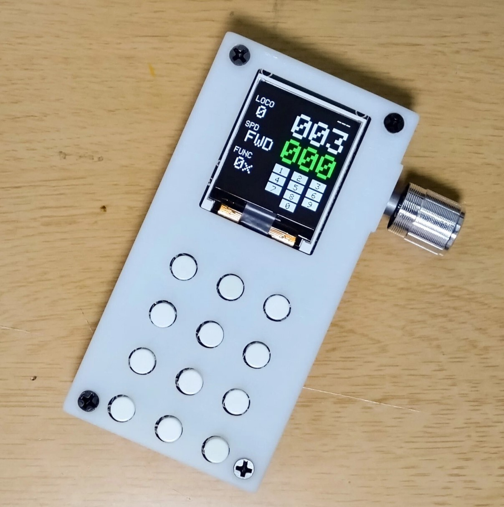
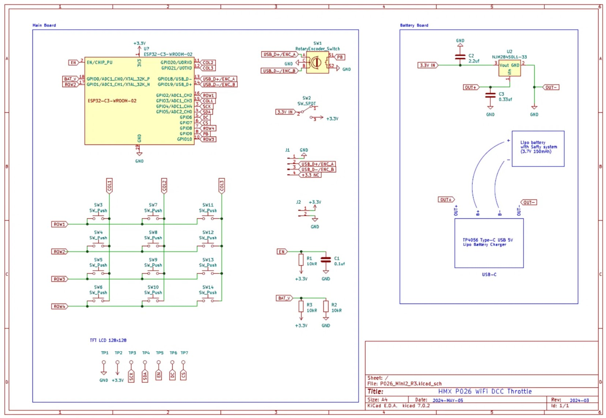

# WiTcontroller for ESP32C3

I modified Mr Peter Akers' WiTcontroller so that it can be used with ESP32C3.
I should express my respect for his great accomplishment.
I'm new to forking on GIthub.
I would be very grateful if you could point out any mistakes.

Mr Peter AkersさんのWiTcontrollerをESP32C3で使えるように修正しました。
彼の偉大な功績に感謝しています。
私はGitHubでフォークをするのは初めてです。
なにか誤りがあれば、指摘して頂けると大変助かります。

<h2>Basic Note</h2>
This project deals with two types of devices:  
OLED Display 0.96" 128x64 Blue I2C IIC SSD1306  
and  
TFT LCD Display 1.44-inch 128x128 ST7735 
For the latter, please refer to the branch.  
https://github.com/HMX-1972/WiTcontroller_for_ESP32C3/blob/ST7735-128x128-TFT/
 
For operation instructions and menu expansion, please refer to the original URL below. 
https://github.com/flash62au/WiTcontroller 
 
このプロジェクトでは 
OLED Display 0.96" 128x64 Blue I2C IIC SSD1306 
と 
TFT LCD Display　1.44-inch 128x128 ST7735 
の2種類を扱っています。 
後者はbranchを参照してください。 
https://github.com/HMX-1972/WiTcontroller_for_ESP32C3/blob/ST7735-128x128-TFT/
 
操作方法やメニューの拡張などはオリジナルである次のURLを参照ください 
https://github.com/flash62au/WiTcontroller 
 

<h2>Difference</h2>
* ESP32C3 * 
Compared to ESP32, it has the following limitations: 
- Not scalable due to limited number of I/Os. 
- Returning from sleep requires turning the power back on. 
* ST7735 * 
There are some limitations compared to the 128x64 SSD1306: 
- The LED power on the ST7735 cannot be turned off, so you must turn it off manually. 
 
* ESP32C3 * 
ESP32とに比較として次の制限があります。 
- I/Oの数が限定されるために拡張性がありません。 
- スリープからの復帰には電源の再投入が必要です。 
* ST7735 * 
128x64 SSD1306と比較して次の制限があります。 
- ST7735のLED電源はきれません。つまり手動でOFFしてください。 

<h2>Hardware</h2>
have created several Wifi Throttles so far. 
I have made this compatible with three of them. 
 
私はこれまでに複数のWifi Throttleを作成してきました。 
そのうちの３種類に対応させています。   

*Photo01 P004*

*Photo02 P008*

*Photo03 Diagram*

*Photo04 P026*

*Photo05 Diagram*

### V1.45
- Diverged from the original

### prior 
- various
